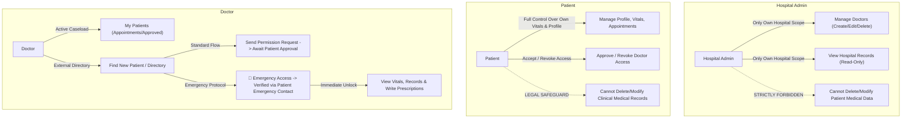
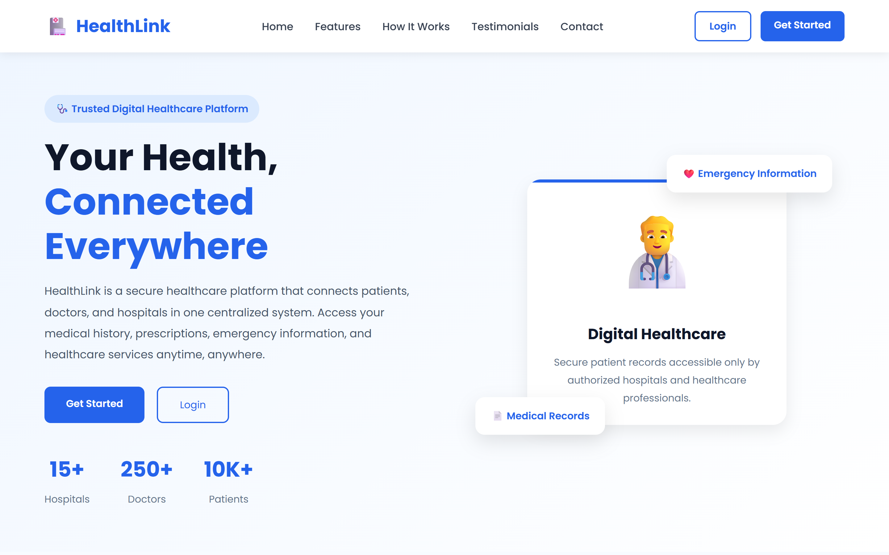
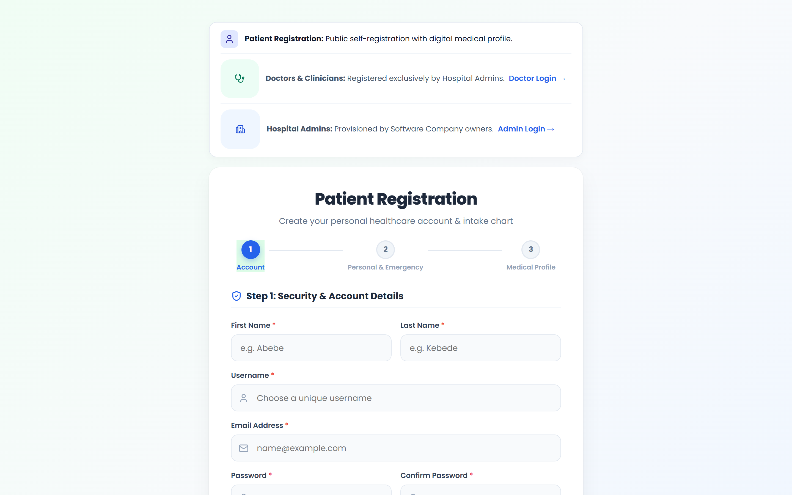
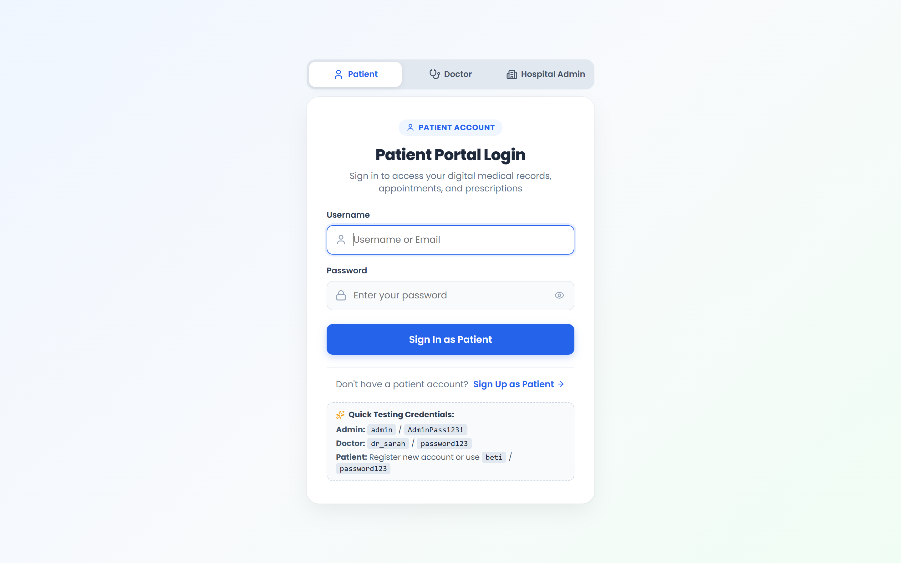
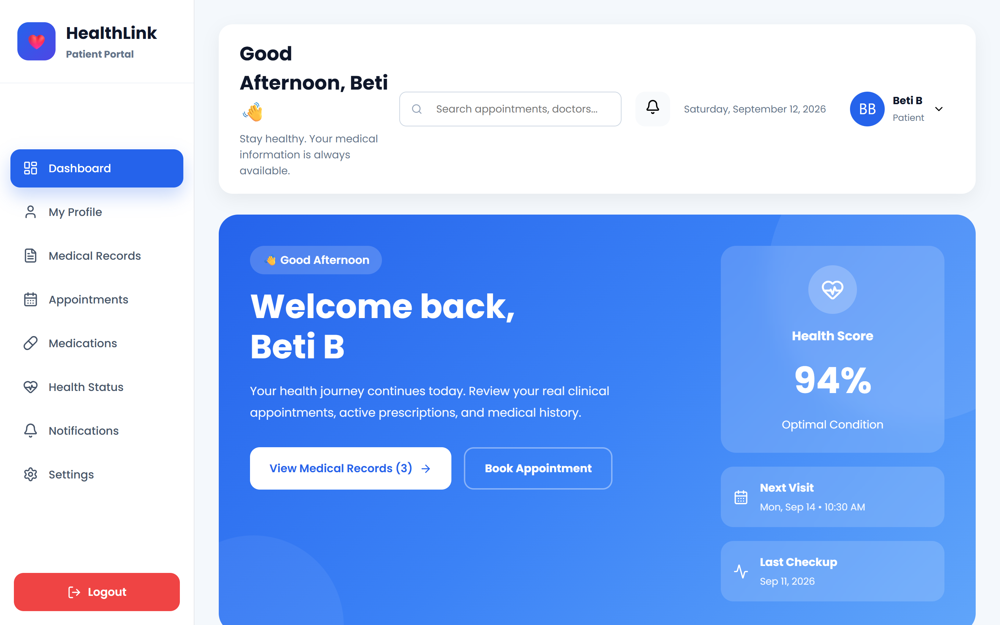
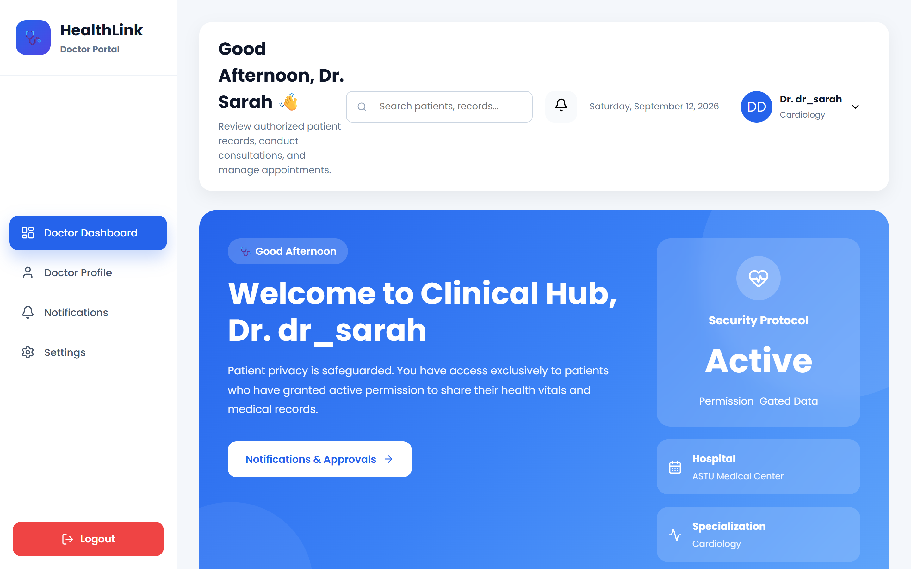
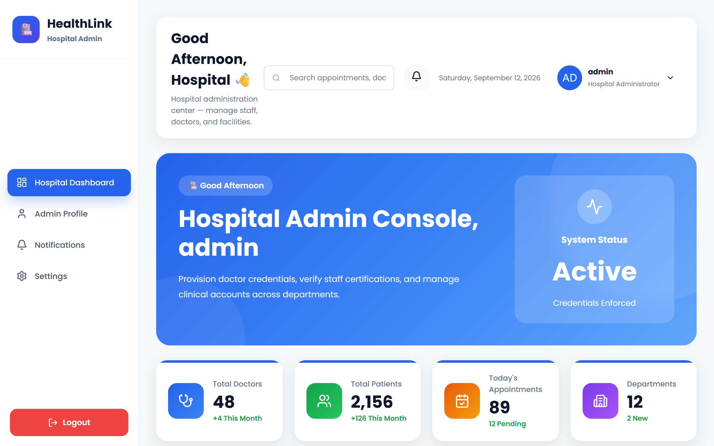

# HealthLink 🩺

> **Next-Generation Electronic Health Records (EHR) & Hospital Management Platform** with granular Role-Based Access Control (RBAC), Patient Consent Verification, and Emergency Clinical Override Protocols.

[](https://www.djangoproject.com/)
[](https://www.django-rest-framework.org/)
[](https://reactjs.org/)
[](https://vitejs.dev/)
[](https://jwt.io/)

---

## 📌 Overview

**HealthLink** is a secure healthcare information system designed to bridge the workflow between **Patients**, **Doctors/Clinicians**, and **Hospital Administrators**. Built on healthcare compliance and data privacy principles, HealthLink ensures patient data sovereignty, clinical record immutability, and instant lifesaving emergency access.



---

## 📸 Application Preview & Screenshots

Explore the key interfaces of the HealthLink ecosystem across Patient, Doctor, and Hospital Administrator workflows:

### 1. Landing & Discovery Page
Modern, responsive homepage showcasing healthcare features, service statistics, and direct portals for patients, clinicians, and administration.


---

### 2. Multi-Step Patient Onboarding & Clinical Intake
Interactive patient registration capturing contact information, blood group, emergency contacts, and comprehensive medical history questionnaires with comfortable icon ergonomics.


---

### 3. Role-Based Authentication Hub
Unified security portal supporting isolated login pathways with distinct credential policies for Patients, Medical Doctors, and Hospital Admins.


---

### 4. Patient Health Portal & Vitals Dashboard
Patient self-service command center displaying dynamic vitals (blood pressure, heart rate, blood glucose), upcoming appointments, certified medical records, and doctor access request approvals.


---

### 5. Doctor Clinical Workspace & Emergency Override
Clinical hub for physicians to manage active caseloads, record diagnoses, write prescriptions, and request access to external patient histories—including the verified lifesaver **Emergency Access Protocol**.


---

### 6. Hospital Administration Console
Administrative control center with hospital-scoped oversight for staff rosters, doctor credentialing, license tracking, and certified institutional record monitoring.


---

## 🔐 Role-Based Access Control (RBAC) Architecture

HealthLink enforces a 3-tier separation of duties across all endpoints and UI views:

### 1. 🏥 Hospital Administrator
- **Account Creation**: Provisioned strictly by **Software Company Owners** via secure CLI tooling (`create_hospital_admin.py`).
- **Hospital Scope Isolation**: Administrators can **only view and manage resources within their own hospital**.
- **Doctor Roster Management**: Admins create doctor accounts, generate temporary credentials, update specialties and licenses, or deactivate accounts.
- **Medical Record Immutability**: Hospital admins can view certified records from their hospital but **cannot edit or delete patient clinical records** (`HTTP 403 Forbidden`).

### 2. 🩺 Doctor / Clinical Staff
- **Account Creation**: Provisioned exclusively by **Hospital Admins** (public doctor self-registration is blocked).
- **Caseload Partitioning**:
  - **My Patients**: Direct access to patients with active appointments or approved consultations.
  - **Hospital / External Registry**: Doctors can search external patients across the network.
- **Patient Privacy Barrier**: Health records for patients outside active caseload remain locked (`HTTP 403 Forbidden`) until authorized.
- **Two Access Pathways**:
  1. **Standard Permission Flow**: Doctor requests consent with clinical consultation notes; patient approves or declines from their portal.
  2. **Emergency Access Override**: In critical/trauma emergencies, doctors enter the patient's **Emergency Contact Name** and **Phone Number**. The system verifies against the patient's record on file, immediately unlocks full clinical access, logs an immutable audit event, and alerts the patient.

### 3. 👤 Patient
- **Self-Registration**: Public onboarding with personal demographics, emergency contact details, blood type, and clinical health questionnaire (allergies, chronic conditions, surgical history).
- **Data Sovereignty**: Full control to update personal profile, log daily vital signs (blood pressure, heart rate, blood glucose), and request appointments.
- **Consent Control**: Patients receive interactive notifications to grant or revoke doctor access to their health records at any time.
- **Legal Safeguard**: Patients **cannot alter or delete clinical medical records** entered by doctors, preserving legal integrity and medical compliance.

---

## 🚀 Quick Start Guide

### Prerequisites
- **Python** 3.10+
- **Node.js** 18+ & **npm**
- **Git**

---

### Backend Setup (Django & DRF)

1. **Navigate to the backend directory**:
   ```bash
   cd backend
   ```

2. **Create and activate a virtual environment**:
   ```bash
   # Windows (PowerShell)
   python -m venv env
   .\env\Scripts\Activate.ps1

   # macOS / Linux
   python3 -m venv env
   source env/bin/activate
   ```

3. **Install dependencies**:
   ```bash
   pip install -r requirements.txt
   ```

4. **Apply database migrations**:
   ```bash
   python manage.py migrate
   ```

5. **(Optional) Seed comprehensive demo data**:
   ```bash
   python seed_all_patient_real_data.py
   ```

6. **(Optional) Provision a Hospital Admin account**:
   ```bash
   python create_hospital_admin.py --username admin --password AdminPass123! --hospital "HealthLink Central Hospital"
   ```

7. **Start the backend development server**:
   ```bash
   python manage.py runserver
   ```
   *Backend runs on `http://127.0.0.1:8000`.*

---

### Frontend Setup (React & Vite)

1. **Navigate to the frontend directory**:
   ```bash
   cd ../frontend
   ```

2. **Install Node modules**:
   ```bash
   npm install
   ```

3. **Start the development server**:
   ```bash
   npm run dev
   ```
   *Frontend opens at `http://localhost:5173`.*

---

## 🔑 Demo Login Credentials

For testing and demonstration, pre-configured role credentials:

| Role | Username | Password | Details / Scope |
| :--- | :--- | :--- | :--- |
| **Hospital Admin** | `admin` | `AdminPass123!` | HealthLink Central Hospital • Full Doctor Management |
| **Doctor** | `dr_sarah` | `password123` | Cardiology Specialist • Active Patient Caseload & Emergency Access |
| **Doctor** | `dr_michael` | `password123` | Internal Medicine • Hospital Staff |
| **Patient** | `beti` | `password123` | Registered Patient (Emergency Contact: Kebede - `+251 911 234567`) |
| **Patient** | `dawit_henok` | *created via signup* | New Patient Registration with Health Intake |

---

## 🧪 Testing & Verification

### Automated Backend Tests
Run the comprehensive 9-point security, permission, and emergency override test suite:
```bash
cd backend
python manage.py test api.tests
```
```
Ran 9 tests in 40.621s
OK
```

**Key test coverage:**
- Public signup rejection for doctor roles.
- Patient self-registration with blood type and emergency contact.
- Hospital admin creation of doctor accounts with temporary passwords.
- Role-based scoping: hospital admins strictly isolated to their hospital.
- 403 Forbidden enforcement preventing patients & admins from deleting medical records.
- Access request flow: locked records -> request -> patient approval -> unlocked records -> revocation.
- Emergency contact verification override: matching contact unlocks access immediately (`HTTP 200`); mismatched contact is rejected (`HTTP 400`).

### Frontend Production Build
```bash
cd frontend
npm run build
```
Compiled with Vite in `< 1.0s` with **0 errors**.

---

## 🛠️ Tech Stack

- **Frontend**: React 18, Vite, React Router DOM v6, Lucide React Icons, React Portals, CSS3 Grid/Flexbox.
- **Backend**: Python 3, Django 5, Django REST Framework, Django CORS Headers, SimpleJWT.
- **Database**: SQLite (Development) / PostgreSQL compatible.
- **Authentication**: Stateless JSON Web Tokens (`access` + `refresh` tokens).

---

## 📄 License

This project is licensed under the [MIT License](LICENSE).
